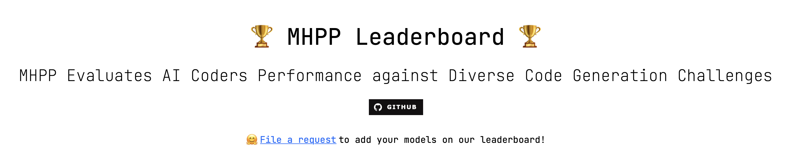

## The official Repo of the paper [MHPP: Exploring the Capabilities and Limitations of Language Models Beyond Basic Code Generation](https://arxiv.org/abs/2405.11430) 📄✨

Welcome to the official repository of our paper! 🎉

The dataset can be found in the `data` directory, which includes details of each question, such as the question's challenge type. The raw questions can be accessed using the 'question' field. We also provide a version of the prompt with a prefix for users, as mentioned in the paper. Creating this dataset was labor-intensive. If you find any errors, please submit an issue to provide feedback. Thank you very much! 🙏

The leaderboard is available at [MHPP Leaderboard](https://sparksofagi.github.io/MHPP/). 🏆



### To submit model results:

1. Run your model on our dataset in the `/data/` folder. You can either take the "prompt" field as input (as we do in the paper) or create a new input by adding more user instructions before or after the "question" field. 💻
2. Save the result in JSONL format. Each line should at least contain 'function_name', 'prompt', 'difficulty_types', and 'response'.
3. Run command below to upload your JSONL file to our server, remember to replace "file_name" to your real filename:
```shell
curl -F "file=@file_name.jsonl" http://52.155.102.219:3000/upload
# Example
# curl -F "file=@gpt4o_2024_05_13.jsonl" http://52.155.102.219:3000/upload
```
4. Wait. ⏳
5. Get your model result with a detailed report. 📊
6. (Optional) If you wish to have your result featured on the leaderboard, or if you have any further questions, please click "[File a request](https://github.com/SparksofAGI/MHPP/issues/new?assignees=&labels=model+eval&projects=&template=model_eval_request.yml&title=💡+%5BREQUEST%5D+-+%3CMODEL_NAME%3E)" on the leaderboard page. This will allow you to create an issue, fill in the necessary information, and submit it. 📤


Thank you for your interest and participation! 😊


## 📝 Citation

If you use MHPP in your research, please consider citing us:

```bibtex
@article{dai2024mhpp,
  title={MHPP: Exploring the Capabilities and Limitations of Language Models Beyond Basic Code Generation},
  author={Dai, Jianbo and Lu, Jianqiao and Feng, Yunlong and Ruan, Rongju and Cheng, Ming and Tan, Haochen and Guo, Zhijiang},
  journal={arXiv preprint arXiv:2405.11430},
  year={2024}
}
```
